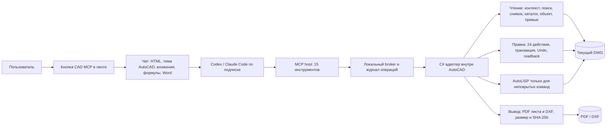

# Возможности CAD MCP 0.4.0 и ориентиры развития

Код C# работает в процессе AutoCAD; MCP и провайдер общаются с ним через локальный broker. Правка возвращает созданные объекты и ревизию. Чтение специальных объектов Civil 3D, Map 3D и СПДС сейчас включает тип, границы и доступные ограниченные скалярные свойства. Полные поверхности, сети, профили, объектные данные Map и специализированные правки пока не реализованы. Редактирование доступно в текущем пространстве. Создание листа пока создаёт пустой лист; видовые экраны, оформление по СПДС/ГОСТ и выпуск комплекта требуют отдельных операций.

| Реализация | Полезная идея из опубликованного кода и описания | Состояние у нас |
|---|---|---|
| [beiming183-cloud/AutoCAD-MCP](https://github.com/beiming183-cloud/AutoCAD-MCP) | Проверка геометрии после записи, топологические проверки, более широкий набор 3D-операций и подтверждение итоговых файлов | Есть транзакция и readback; топология, 3D sweep/boolean и проверка финального комплекта ещё нужны |
| [U-C4N/Autocad-MCP](https://github.com/U-C4N/Autocad-MCP) | Листы, шаблоны, проверки стандартов, критикующий проход после построения, ведомости и специализированные инструментальные пакеты | Создание листа и PDF добавлены; видовые экраны, шаблоны СПДС, автоматический аудит и ведомости ещё нужны. Количество инструментов в их README меняется; оценка конкретной функции требует проверки кода и запуска |
| [Slacker-LLC/autocad-mcp](https://github.com/Slacker-LLC/autocad-mcp) | Явные единицы, проверка параметров, захват настоящего вида из AutoCAD | Есть единицы DWG, валидация, реальный preview; нужна геометрическая привязка изображения к координатам |
| [zymorel/autocad-mcp-community](https://github.com/zymorel/autocad-mcp-community) | Заявлены Civil 3D поверхности/трассы/профили, Map 3D и геоданные | Модули перечислены в репозитории, но их корректность на наших версиях не подтверждена; нужны нативные SDK-адаптеры и тестовые DWG |

Следующие равноприоритетные ветки: **листы/выпуск** (видовые экраны, печатные настройки, титулы, несколько PDF и ведомость файлов) и **вертикальные объекты** (Civil 3D поверхности, трассы, профили и сети; Map 3D объектные данные и системы координат). В обеих ветках сначала нужны типизированное чтение и проверки, затем C# редактирование. AutoLISP остаётся запасным способом там, где Autodesk не предоставляет подходящий managed API. [Autodesk описывает построение блоков и листов через .NET](https://help.autodesk.com/cloudhelp/2027/PLK/OARX-DevGuide-Managed/files/GUID-DF67671C-101D-4917-808B-DD2C5BE3C7E9.htm); [для Civil 3D требуются отдельные библиотеки AeccDbMgd/AecBaseMgd](https://help.autodesk.com/cloudhelp/2025/ENU/Civil3D-DevGuide/files/GUID-267E68C8-AD2D-4F7F-87DF-831018D56CDB.htm).
