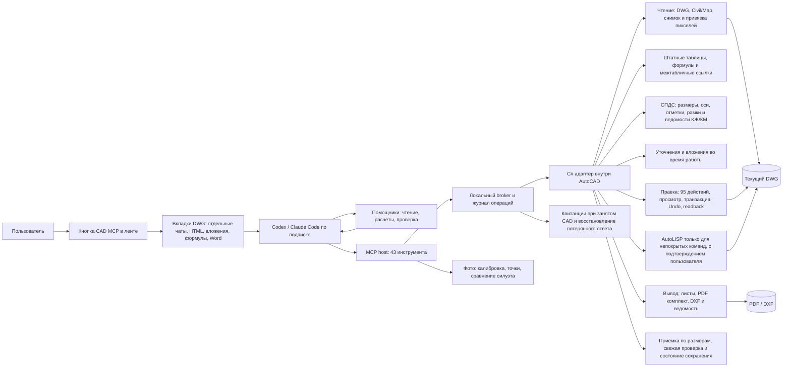

# Возможности CAD MCP 0.10.0 и ориентиры развития

В 0.7.0 измеряемые критерии проверяются до commit с откатом неверного пакета; после выполнения объекты можно перечитать через `cad_verify`. Статус операции доступен вне очереди DWG, потерянный ответ не приводит к повторной отправке изменения. Фото калибруются по известным точкам, а заданные агентом контуры сравниваются с итоговым видом. Это не автоматическая реконструкция полной 3D-модели. [Контракт, примеры и ограничения](result-verification.md).

Код C# работает в процессе AutoCAD; MCP и провайдер общаются с ним через локальный broker. Правка возвращает созданные объекты и ревизию. Нативные операции включают произвольные многоугольные 3D-сетки, пространственные кривые, выдавливание, sweep, вращение профиля и булевы операции над телами. Листы получают видовые экраны, параметры печати и блоки оформления; пакетный выпуск создаёт несколько PDF и ведомость. Растры привязываются к WCS по опорным точкам, а снимки вида калибруются отдельно. Для Civil доступны ограниченный каталог и TIN-операции; для Map — чтение системы координат и объектных данных. Специальные функции Civil/Map пока не проверены в работающих вертикальных продуктах. СПДС/ГОСТ и содержание PDF-комплекта требуют отдельной проверки.

| Реализация | Полезная идея из опубликованного кода и описания | Состояние у нас |
|---|---|---|
| [beiming183-cloud/AutoCAD-MCP](https://github.com/beiming183-cloud/AutoCAD-MCP) | Проверка геометрии после записи, топологические проверки, более широкий набор 3D-операций и подтверждение итоговых файлов | Есть транзакция, readback, 3D sweep и булевы операции, топологическая проверка `cad_review`, повторное чтение PDF/DXF |
| [U-C4N/Autocad-MCP](https://github.com/U-C4N/Autocad-MCP) | Листы, шаблоны, проверки стандартов, критикующий проход после построения, ведомости и специализированные инструментальные пакеты | Видовые экраны и ведомости реализованы; проверки размеров, шрифтов, полей и нумерации листов добавлены. Контракт правил ГОСТ/СПДС ещё нужен |
| [Slacker-LLC/autocad-mcp](https://github.com/Slacker-LLC/autocad-mcp) | Явные единицы, проверка параметров, захват настоящего вида из AutoCAD | Есть единицы DWG, валидация, реальный preview и калибровка пикселей по опорным точкам |
| [zymorel/autocad-mcp-community](https://github.com/zymorel/autocad-mcp-community) | Заявлены Civil 3D поверхности/трассы/профили, Map 3D и геоданные | По разбору кода (октябрь 2026) модули Civil и Map неработоспособны, лицензии нет; код не используется. Наши Civil-операции сверены с дампами сигнатур Civil 3D 2024–2027 |
| [HorizunGroup/horizun-civil3d-mcp](https://github.com/HorizunGroup/horizun-civil3d-mcp) | Типизированный Civil-плагин с живыми находками и дампами сигнатур | Дампы использованы для офлайн-проверки наших вызовов; кривые трассы и имена стилей/деталей реализованы |

Обзор 77 репозиториев и 379 форков (октябрь 2026) добавил: подтверждение AutoLISP пользователем, пробный прогон правок, повседневные 2D-операции, топологию и проверки выпуска, сводки и ведомости объёмов, ленту изменений, кривые трасс Civil и стенд оценки агентов (`benchmarks/`). Всё это собрано и покрыто модульными тестами, но в работающем AutoCAD ещё не проверено.

Следующие проверки: визуальное сравнение PDF с листами DWG, независимые контрольные точки для растра и живые Civil/Map DWG с объектными данными, трассами и сетями. После этого — точные C# операции для редактирования трасс, профилей, сетей и Map OD. AutoLISP остаётся запасным способом там, где Autodesk не предоставляет подходящий managed API. [Autodesk описывает построение блоков и листов через .NET](https://help.autodesk.com/cloudhelp/2027/PLK/OARX-DevGuide-Managed/files/GUID-DF67671C-101D-4917-808B-DD2C5BE3C7E9.htm); [для Civil 3D требуются отдельные библиотеки AeccDbMgd/AecBaseMgd](https://help.autodesk.com/cloudhelp/2025/ENU/Civil3D-DevGuide/files/GUID-267E68C8-AD2D-4F7F-87DF-831018D56CDB.htm).
